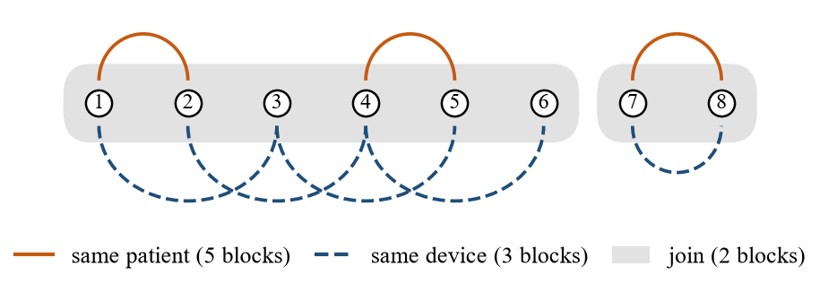

# §3 Problem Formulation and HCP Feasibility

> **v7 — 2026-10-02.** Prosa penghubung diparafrasekan penuh dari v6 (commit 3edc1f0). Pernyataan formal (Proposisi 1–3 + bukti, Corollary 1–2, Definisi, "Scope of Corollary 2") dan persamaan (1)–(6) kata per kata sama. **2026-10-03:** persamaan dinomori ulang menurut urutan kemunculan — DEff (6)→(4), superset (4)→(5), label-conditional (5)→(6); rujukan silang di §4–§6 dan Lampiran A ikut diubah.

---

## 3. Problem Formulation and HCP Feasibility

Section 3.1 restates the notation of Lee et al. [A0]; §3.2–§3.4 derive three
feasibility diagnostics from established results, each cited where it is used.

### 3.1 Hierarchical calibration

Data are organized in $K$ blocks: block $k$ contains $N_k$
observations $Z_{k,1},\dots,Z_{k,N_k}$, the total is $n=\sum_k N_k$, and $H$ is the
harmonic mean of the $N_k$. Here a block is usually a patient and an observation
a 10-second recording, though the framework does not depend on that choice.
Nesting breaks ordinary exchangeability, and Lee et al. [A0] replace it with
**hierarchical exchangeability**: blocks are exchangeable among themselves and
observations within a block, while the pooled sample is not.

Fix a nonconformity score $s(\cdot)$ independently of the calibration data, set
$s_{k,i}=s(Z_{k,i})$, and denote by $Q_\beta(F)=\inf\{t:F(t)\ge\beta\}$ the lower
$\beta$-quantile of a distribution $F$ on $\mathbb{R}\cup\{+\infty\}$. Of the $K$
blocks, $K_1$ are held out as calibration blocks. For a target miscoverage
$\alpha\in(0,1)$, the HCP threshold is

$$\hat T \;=\; Q_{1-\alpha}\!\left(\sum_{k=1}^{K_1}\sum_{i=1}^{N_k}\frac{1}{(K_1+1)N_k}\,\delta_{s_{k,i}}\;+\;\frac{1}{K_1+1}\,\delta_{+\infty}\right).\tag{1}$$

Each block receives mass $1/(K_1+1)$, split evenly over its $N_k$ observations,
and a further $1/(K_1+1)$ sits at $+\infty$, the price of not knowing which block
the test point comes from. The prediction set is
$\hat C(x)=\{y\in\mathcal{L}:s(x,y)\le\hat T\}$ for a label set $\mathcal{L}$. For a
test point from a new block, Lee et al. [A0, Thm. 1] establish the lower bound
in (2); the upper bound holds under the additional condition that the scores are
distinct almost surely:
$$1-\alpha\;\le\;\mathbb{P}\{Y_{\text{test}}\in\hat C(X_{\text{test}})\}\;\le\;1-\alpha+\frac{2}{K_1+1}.\tag{2}$$

### 3.2 Finite-threshold feasibility

Given $K_1$, $\{N_k\}$ and $\alpha$, (1) fixes the threshold but not whether the
guarantee is informative.

**Proposition 1 (feasibility).** $\hat T<\infty$ if and only if
$$\alpha\;\ge\;\frac{1}{K_1+1}.\tag{3}$$

*Proof.* The finite atoms in (1) carry total mass
$\sum_k N_k/\{(K_1+1)N_k\}=K_1/(K_1+1)$, so the weighted CDF $\hat F$ in (1)
satisfies $\hat F(t)\le K_1/(K_1+1)$ for every finite $t$, with equality at
$t=M=\max_{k,i}s_{k,i}$. Since $Q_{1-\alpha}(\hat F)=\inf\{t:\hat F(t)\ge1-\alpha\}$,
the threshold is finite iff $K_1/(K_1+1)\ge1-\alpha$. ∎

If (3) fails, $\hat C(X)=\mathcal{L}$ for every input and (2) holds only
vacuously. Proposition 1 follows directly from the threshold definition of [A0],
restated as (1), where it is implicit rather than stated; we make it explicit because it can
be checked from metadata, and we write $\alpha_{\min}=1/(K_1+1)$ for the smallest
attainable level. Three properties matter. $N_k$ is absent from the bound, so
adding measurements to existing blocks never restores feasibility; the inequality
is not strict, so a grouping exactly on the boundary is feasible (Appendix A.1);
and with $N_k=1$ throughout, the bound reduces to the split-conformal condition
$n\ge1/\alpha-1$, which we also confirmed numerically.

**Corollary 1.** The minimum number of calibration blocks is
$K_{\min}(\alpha)=\lceil 1/\alpha\rceil-1$; at $\alpha=0.05$ this is 19, not 20.

For subject-level split conformal prediction, where each subject is one
exchangeable unit, Sim and Kim give the same count of 19 at $\alpha=0.05$ [E6],
and Dunn et al. state comparable group counts for their constructions [A0b]. For
HCP the count holds whatever the block sizes, because $N_k$ does not enter (3).

**Precision.** Unlike feasibility, precision needs distributional assumptions,
namely **Assumption (A)**: blocks are independent and identically distributed,
and any two indicators $\mathbb{1}\{s\le t\}$ within a block share a correlation
$\rho(t)$ that does not vary with $N_k$ (compound symmetry), so $\rho(t)$ is the
intraclass correlation of the indicator, not of the raw score. The HCP threshold
is a functional of $\hat G(t)=\frac{1}{K_1}\sum_k \bar F_k(t)$, the unweighted
average of block-level empirical CDFs, whose variance under (A) follows from
averaging $K_1$ independent block means with equal weights,
$\sigma^2(t)[1+(H-1)\rho(t)]/(K_1H)$ with $\sigma^2(t)=F(t)\{1-F(t)\}$
(Appendix A.2). This block-weighted design effect and the observation-weighted
one behind the Kish effective sample size agree only for equal block sizes:

$$
\mathrm{DEff}_{\text{block}}(\rho)=\frac{n[1+(H-1)\rho]}{K_1H},
\qquad
\mathrm{DEff}_{\text{pooled}}(\rho)=1+\Big(\frac{\sum_k N_k^2}{n}-1\Big)\rho .
\tag{4}
$$

The second is the usual design effect for unequal clusters; for the coverage of a
pooled threshold it takes the same form with the indicator correlation in place of
$\rho$ [P1]. In cluster-randomized trials, minimum-variance weighting of cluster
means is more efficient than equal weighting when cluster sizes vary [I1, A13];
in HCP equal weighting is built into the threshold, and
dropping it can invalidate the guarantee (Appendix A.3).

**The axis used to organize results.** Datasets with very different block
geometry are compared through $\mathrm{DEff}=1+(H-1)\rho$, which predicts no harm
from dependence when blocks are near singletons, however strong the within-block
correlation. The axis is a heuristic under (A) for ranking configurations, not a
calibrated effective sample size. Noonan derives a large-sample variance for the
coverage of a threshold estimated from clustered data, in which the relevant
correlation is that of the exceedance indicator rather than of the score and can
change with the target level [P1]. The primary analysis estimates $\rho$ from
conformity scores, and every analysis on this axis is therefore repeated with the
indicator correlation $\rho(t)$ (§5.4).

### 3.3 Crossed dependence sources

Clinical datasets often offer several blocking variables at once, such as
patient, device, operator and site, and nothing guarantees that they nest.

**Definition (sufficiency).** A partition $\mathcal{Q}$ is *sufficient* for a
dependence source with partition $\mathcal{P}$ if $\mathcal{P}$ refines
$\mathcal{Q}$, i.e. every $\mathcal{P}$-block lies inside a single
$\mathcal{Q}$-block. Otherwise dependent observations fall into different
$\mathcal{Q}$-blocks and are treated as independent.

**Proposition 2 (crossed designs force the join).** For $\mathcal{Q}$ to be
sufficient for both $\mathcal{P}_1$ and $\mathcal{P}_2$, it must be coarser than
each. The finest such $\mathcal{Q}$ is the join $\mathcal{P}_1\vee\mathcal{P}_2$ in
the partition lattice: the connected components of the graph linking two
observations whenever they share a $\mathcal{P}_1$-block or a $\mathcal{P}_2$-block.
Consequently $K(\mathcal{P}_1\vee\mathcal{P}_2)\le\min\{K(\mathcal{P}_1),K(\mathcal{P}_2)\}$
and $\alpha_{\min}(\mathcal{P}_1\vee\mathcal{P}_2)\ge\max\{\alpha_{\min}(\mathcal{P}_1),\alpha_{\min}(\mathcal{P}_2)\}$.

*Proof.* If $\mathcal{Q}$ is sufficient for both sources, every
$\mathcal{P}_1$-block and every $\mathcal{P}_2$-block lies within one
$\mathcal{Q}$-block, so two observations joined by a chain of shared
$\mathcal{P}_1$- or $\mathcal{P}_2$-blocks also lie within one $\mathcal{Q}$-block.
Every $\mathcal{Q}$-block is therefore a union of connected components. The
components themselves form a partition sufficient for both sources, so they are
the finest such $\mathcal{Q}$. Since the join is coarser than each
$\mathcal{P}_j$, it has no more blocks, and $\alpha_{\min}=1/(K_1+1)$ cannot
decrease. ∎

The join is standard in partition lattices; what matters here is its consequence
for calibration. Fig. 2 illustrates it on eight hypothetical records: five
patient blocks and three device blocks, each acceptable alone, shrink to two once
both sources must be respected.

**Corollary 2 (impossibility).** If $K_1(\mathcal{P}_1\vee\mathcal{P}_2)<\lceil1/\alpha\rceil-1$, no HCP calibration yields a non-trivial guarantee at level $\alpha$ while accounting for both dependence sources; the same holds for any finite set of declared sources, with their join $\mathcal{P}_1\vee\dots\vee\mathcal{P}_m$ in place of $\mathcal{P}_1\vee\mathcal{P}_2$. This is a property of the study design, not of the score function or the fitted model.

*Proof.* By Proposition 2, any grouping sufficient for the declared sources is at
least as coarse as their join and so has at most
$K_1(\mathcal{P}_1\vee\mathcal{P}_2)$ calibration blocks; Proposition 1 then gives
$\hat T=+\infty$. The join of $m$ sources follows by applying Proposition 2
repeatedly. ∎

**Scope of Corollary 2.** We prove Corollary 2 for HCP as defined in (1). Dunn et
al. state group-count conditions for their finite-sample constructions: double
conformal can produce non-trivial sets if $k\ge4/\alpha-1$ [A0b, Thm. 3], the
unsupervised subsampling constructions if $k\ge2/\alpha-1$ or $k>2/\alpha-1$
[A0b, Thms. 5–6], and the supervised subsampling constructions require
$k>1/\alpha-1$ [A0b, Thms. 9–10], with $k$ the number of groups. Because these
conditions are stated in the number of groups, Proposition 2 implies that they
must be checked on the join of the declared sources. CDF pooling, whose coverage
is asymptotic, has no such finite-sample condition [A0b]. Whether every
distribution-free method whose validity rests on between-block exchangeability
faces a comparable bound is not addressed here.

**Admissible groupings.** A calibration grouping $g$ is admissible at level
$\alpha$ if it passes **(S1) feasibility**, $K_1(g)\ge\lceil 1/\alpha\rceil-1$,
exact by Proposition 1, and **(S2) sufficiency**, every *declared* dependence
source nested in $g$, exact relative to that declaration. S1 alone is not enough,
since a grouping can admit a finite threshold yet leave dependence between its
blocks. S2 is only as complete as its input: an undeclared source passes
trivially, so S2 checks that a stated assumption is consistent, not that it
holds. With crossed sources the finest grouping passing S2 is their join
(Proposition 2). In leakage control, joins of fine groupings are known to form
giant components [P2], but there a collapsed join merely weakens a split; here,
below $1/(K_1+1)$, no finite threshold exists (Corollary 2). Since no dataset can
confirm the declared set, every verdict is reported as a function of that set,
not as a property of the data.

### 3.4 Label-conditional feasibility

The PTB-XL diagnoses form a three-level tree of 5 superclasses, 23 subclasses
and 44 diagnostic SCP statements. A recording may carry several labels, so the
target is a set $Y\subseteq\mathcal{L}$ and coverage must be defined.
**Superset coverage**,
$$\mathbb{P}\big(Y_{\text{test}}\subseteq\hat C(X_{\text{test}})\big)\;\ge\;1-\alpha,\tag{5}$$
involves nothing new: Theorem 1 of [A0] needs only a fixed scalar score, and with
$s(x,Y)=\max_{\ell\in Y}s_\ell(x)$ one has $\{Y\subseteq\hat C\}\iff s(x,Y)\le\hat T$,
so HCP carries over unchanged. The substance lies in the **label-conditional**
target
$$\mathbb{P}\big(\ell\in\hat C(X)\,\big|\,\ell\in Y\big)\;\ge\;1-\alpha,\tag{6}$$
which admits no such reduction. Label-conditional calibration computes, for each
label $\ell$, an HCP threshold from the calibration observations carrying $\ell$
only; we call it the per-label threshold. Rare classes are known to starve
class-conditional calibration under exchangeability [A12]; under hierarchical
dependence the count that matters is that of blocks.

**Proposition 3 (necessary condition).** *A finite per-label HCP threshold for
label $\ell$ at level $\alpha$ requires $\alpha \ge \tfrac{1}{K_1(\ell)+1}$, where
$K_1(\ell)$ is the number of calibration blocks containing at least one instance
of $\ell$.*

The condition is necessary, not sufficient. Conditioning a test observation on
$\ell$ draws its block with probability proportional to its share of
$\ell$-positive observations, whereas a calibration block qualifies with a single
one. Unless that share is equal across blocks, test and calibration blocks are no
longer exchangeable and the rank argument does not give
$\mathbb{P}(\ell\in\hat C\mid\ell\in Y)\ge1-\alpha$, because the test block is a
size-biased draw. Proposition 3 is therefore used only to
exclude guarantees, never to certify them. A block containing a label also
contains its ancestors, so $K_1(\ell)$ cannot decrease toward the root and the
condition fails along a frontier of the taxonomy that metadata can map. A union
bound over $m$ jointly controlled labels raises the requirement to
$K_1(\ell)\ge\lceil m/\alpha\rceil-1$ for each $\ell$.

---

## Catatan penyusunan

| Hal | Keputusan |
|---|---|
| Kata per kata | Prop. 1 + bukti, Corollary 1, Definisi, Prop. 2, Corollary 2, "Scope of Corollary 2", Prop. 3, persamaan (1)–(6), keterangan Fig. 2 (skema join; Fig. 1 sejak 2026-10-03 adalah alur audit di §1) |
| Diparafrasekan | Seluruh prosa penghubung, Asumsi (A) (isi sama), paragraf bobot sama, sumbu DEff, "Admissible groupings", §3.4 |
