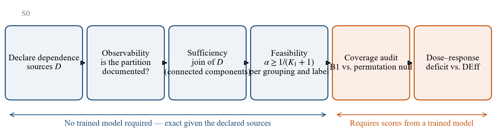

# §4 Audit Design

> **v7 — 2026-10-02.** Diparafrasekan penuh dari v6 (commit 3edc1f0). Semua angka dataset, split dan hiperparameter, Tabel 4.1–4.2 dan keterangan Fig. 2 tetap.

---

## 4. Audit Design

The audit runs in two stages. In the first, the three diagnostics of §3 are
evaluated from metadata, before any model is trained. In the second, naive split
conformal (B1) and HCP (B12) are compared for coverage and set size on held-out
blocks, over 200 random block-level splits per configuration and on three
backbones with 0.10 M, 7.2 M and 16.0 M parameters. The metadata diagnostics —
$K_1$, $K_1(\ell)$ and the join structure — involve no model and must come out
identical for every backbone, which provides a negative control on the pipeline.
PTB-XL fold 10 is not used anywhere, and throughout we keep apart what a dataset
*documents* and what can be *observed* in it. Fig. 2 outlines the protocol and
marks which four steps need only metadata and which two need conformity scores.

### 4.1 Datasets and dependence structures

The three datasets serve different purposes and are not replications of one
another. Table 4.1 states the purpose of each and, for the two primary datasets,
the block geometry that puts them at opposite ends of the design-effect axis.

**Table 4.1.** Roles and block geometry of the three datasets.

| | PTB-XL | MIT-BIH | Challenge 2021 |
|---|---|---|---|
| Role | Primary case: patient-level dependence, multi-label targets, label hierarchy | Strong-dependence end of the design-effect axis | Case study at the limit of observability |
| Block identifier | Documented (`patient_id`) | Documented (record = subject) | Not documented |
| Block unit | patient | record (subject) | — |
| Calibration blocks $K_1$ | 958 | 11 | — |
| Harmonic mean block size $H$ | 1.05 | 1,355 | — |
| Design effect | **1.02** | **703.93** | — |

Within any one dataset the number of blocks and the number of measurements per
block come as a package, so a single dataset, however large, cannot separate
their effects. Only $H$ in Table 4.1 is a structural property of the data. $K_1$
follows from the split design (958 being half of the 1,917 patients in our fold-9
evaluation subset), and the design effect depends on the model, since $\rho$ is
the ICC of the scores produced by a particular backbone. Challenge 2021 is not
meant to support any claim of generality; it is included because a diagnostic
that never returns anything but "admissible" has not shown that it can
discriminate.

**PTB-XL.** This dataset [H1], [H2] comprises 21,799 twelve-lead records from
18,869 patients and is distributed with full metadata under a permissive
licence. We work with the 100 Hz version, i.e. 1,000 samples per 10-second
record, after band-pass filtering at 0.5–40 Hz. Its diagnostic statements fall
into five superclasses that are not mutually exclusive: NORM (9,514), MI (5,469),
STTC (5,235), CD (4,898) and HYP (2,649). These amount to 27,765 labels, and 5,144
records carry more than one superclass. The 411 records (1.9%) without any
diagnostic superclass would be covered trivially under (4), so instead of
assigning them a default class we exclude them from calibration and evaluation.
Every record has an age (median 62; the 293 records of patients older than 89
carry the sentinel value 300), and sex is recorded as 11,354 male and 10,445
female.

Dependence by patient is weak. Patients contribute 1.155 records on average and
at most 10, 88.8% of them contribute only one, and the 5,041 records (23.1%) from
patients with several records form a minority. Three more grouping variables
appear in the metadata — 51 recording sites (17 records missing), 12 nurses
(1,473 missing) and 11 devices (none missing) — and they cross rather than nest,
which is the situation of Corollary 2. The published stratified ten-fold split is
used as released, with 17,418 records in folds 1–8, 2,183 in fold 9 and 2,198 in
fold 10, and no patient straddles two folds. Validation by cardiologists is
uneven across folds: on average 67.0% of records in folds 1–8 (range 64–68%), but
every record in folds 9 and 10. Confirmatory analysis is therefore restricted to
folds 9–10, with fold 10 held in reserve and still unexamined.

**MIT-BIH.** The MIT-BIH Arrhythmia Database [H3] consists of 48 two-channel
recordings of half an hour each, sampled at 360 Hz and annotated beat by beat by
cardiologists. As is customary, the four paced records (102, 104, 107, 217) are
removed, leaving 44. Mapping the annotations to the five AAMI classes gives
100,733 beats. Of these, 40 sit within 128 samples of a record boundary, too close
to fit a full 256-sample (711 ms) window; we drop them instead of zero-padding,
which leaves 100,693. Per class the counts are N 90,087, S 2,781, V 7,008, F 802
and Q 15, and class Q is kept and reported as degenerate rather than merged into
another class. The MLII lead is chosen by name, because record 114 stores its
channels in the order `[V5, MLII]` and choosing by index would quietly
substitute a different lead. The canonical inter-patient partition divides the
records into DS1 and DS2, 22 records each, holding 51,000 and 49,693 beats once
boundary beats are removed. Record length ranges from 1,517 to 3,361 beats
(median 2,257), three orders of magnitude more than a PTB-XL block. Records 201
and 202 belong to one subject yet land on opposite sides of the partition; we
retain the standard split for comparability and disclose the leak.

**Challenge 2021.** The PhysioNet/CinC Challenge 2021 collection [H5] has seven
non-duplicate source folders totalling 66,416 records, ranging from `ningbo`
(34,905) to `st_petersburg_incart` (74). Its `ptb-xl` folder (21,837 records)
repeats PTB-XL and is left out; together the two totals give the official
88,253. In a sample of 42 headers drawn from all seven sources, none of the
fields (`#Age`, `#Sex`, `#Dx`, `#Rx`, `#Hx`, plus `#Sx` in five sources) is
documented as identifying the patient; because this is a sample and the header
schema differs between sources, we claim nothing beyond it. Repetition, on the
other hand, is documented: the INCART source is described as *"74 annotated ECGs
... extracted from 32 Holter monitor recordings,"* and the excluded `ptb-xl`
folder contains 21,837 records from 18,869 patients. Independent units are
therefore fewer than records, and the fact that the partition cannot be observed
is no evidence that records are independent. The source partition, with $K=7$,
is the only grouping the documentation supports, so by Proposition 1 any
calibration on it has $\alpha_{\min}\ge 1/8$, or $1/7$ when one source is held
out; this bound refers to the source partition and not to the dataset. For the
patient partition $K_1$ turns into an assumption that authors must state, and we
do not report a single $\alpha_{\min}$. Sufficiency, moreover, presumes a latent
block structure [A0]; should similarity within an institution fade gradually,
for instance with how close acquisition protocols are, the condition would be
ill-posed rather than just unobservable. All of these checks needed roughly
0.5 MB of downloads (70 index files and 42 headers) out of a 12.6 GB dataset,
before any preprocessing or training.

### 4.2 Calibration and evaluation protocol

B1 is split conformal prediction calibrated as though records or beats were
exchangeable, and B12 is HCP calibrated at the block level [A0]. What we ask is
whether any guarantee can be enforced, not which hierarchical construction is
the most efficient; the constructions of Dunn et al. [A0b] and non-hierarchical
alternatives such as Mondrian conformal prediction therefore lie outside the
comparison.

For PTB-XL, folds 1–6 are used for training and fold 7 for validation, and fold 9
is divided at the patient level into calibration and evaluation halves, with
200–400 repetitions. Fold 8 is left out because its label quality differs from
that of fold 9, and fold 10 is kept for a single final confirmatory evaluation.
For MIT-BIH, training uses DS1 minus four validation records (124, 205, 215,
230), validation uses those four, and DS2 is divided 11/11 at the record level
into calibration and evaluation, again with 200–400 repetitions.

Coverage is computed on the held-out blocks of each split as the fraction of
their observations covered (beats for MIT-BIH, records for PTB-XL) and then
averaged over splits. This observation-weighted coverage is the natural target
of split conformal, whose nominal statement concerns one exchangeable
observation. The guarantee (2) of HCP concerns one observation from a new block
instead, and its empirical counterpart averages coverage within each test block
before averaging over blocks. The two coincide when blocks have equal size, as in
the dose–response design of §5.4, and nearly so on PTB-XL, where most blocks hold
one record; for MIT-BIH both are reported (§5.3). On PTB-XL the coverage reported
is superset coverage (4), obtained from the maximum score over the true labels.

### 4.3 Models and conformity scores

Because conformal guarantees do not depend on the model, the choice of backbone
changes how large prediction sets are, not whether they are valid. The primary
backbone, SmallECGNet, is a compact 1-D convolutional network with 104,389
parameters for 12-lead input and 101,925 for a single lead. Each audit is rerun
with two 1-D residual networks of the PTB-XL benchmark family [F1], ResNet1D-34
(7,225,733 / 7,220,805 parameters) and ResNet1D-50 (15,969,413 / 15,964,485).
These are trained with Adam at a learning rate of $10^{-3}$, with early stopping
on validation loss (patience 5) and a cap of 25 epochs on PTB-XL and 30 on
MIT-BIH; the SmallECGNet weights come from the primary study and are not
retrained. The primary backbone attains a macro-AUROC of 0.9016 on PTB-XL and, on
MIT-BIH, an accuracy of 0.8690 with balanced accuracy 0.3748 and macro-F1 0.3144;
its weakness on minority classes enlarges sets but leaves coverage intact.
Scores are $s(x,y)=1-\hat p_y(x)$ for multi-class MIT-BIH and
$1-\hat\sigma_\ell(x)$ per label for multi-label PTB-XL, where the record-level
score for superset coverage is the maximum over the true labels and thus reduces
to scalar HCP (§3.4).

### 4.4 Statistical analysis

Resampling always acts on blocks, whether patients or records, and never on
single records or beats, since doing so would reproduce the very error under
study. Two kinds of uncertainty are distinguished. Intervals computed over
repeated random splits of a fixed set of blocks describe the Monte Carlo
variability of the split procedure on those blocks; they narrow as splits are
added and are not confidence intervals for the patient population. For the
central MIT-BIH comparison we therefore also treat records as the sampling unit,
through a leave-one-record-out jackknife over the 22 DS2 records with Holm
correction across the three $\alpha$ levels of each backbone; this was added as a
post hoc sensitivity analysis once the distinction was noticed. The analyses
follow an internal analysis protocol that was kept under version control from the
start of the project; it was not publicly registered or formally frozen, and its
deviation log, released with the code, lists every departure from the initial
plan. Friedman–Nemenyi tests are deliberately avoided: they are meant for many
classifiers over many datasets, conventionally five or more, and are
uninformative with two. The procedure used for each reported quantity is listed
in Table 4.2.

**Table 4.2.** Statistical procedures.

| Quantity | Procedure |
|---|---|
| Coverage and set size | Mean over 200 random block-level splits; 2.5–97.5% range across splits |
| B1 deficit against the permutation null | Paired splits (200); Monte Carlo 95% interval from a percentile bootstrap of split-level coverage (4,000 resamples) |
| B1 deficit, record level | Leave-one-record-out jackknife over the 22 DS2 records (500 paired splits per replicate, new permutation per replicate); $t$ interval with 21 df; one-sided $t$ test |
| Multiplicity | Holm–Bonferroni across the three $\alpha$ levels within each backbone (record-level test) |
| Factorial effects | Monte Carlo 95% interval: percentile bootstrap (3,000 resamples of 400 split-level values) |
| Monotonicity in dependence | Spearman correlation across configurations (descriptive; points share the same records) |
| Sensitivity to checkpoint | Agreement of signs between best-validation and last-epoch weights |

### 4.5 Reproducibility

Experiments run on CPU (2 threads) with fixed seeds (seed 0 for every analysis). Each reported number is
stored, together with its configuration, as a JSON artifact under `results/raw/`,
and dataset caches are written atomically so that an interrupted run cannot leave
a partial cache behind.

---

## Catatan penyusunan

| Hal | Keputusan |
|---|---|
| Narasi sebelum float | Fig. 2, Tabel 4.1, Tabel 4.2 didahului kalimat yang menyebut dan menjelaskan isinya |
| Kutipan langsung | INCART: tetap dalam tanda kutip |
