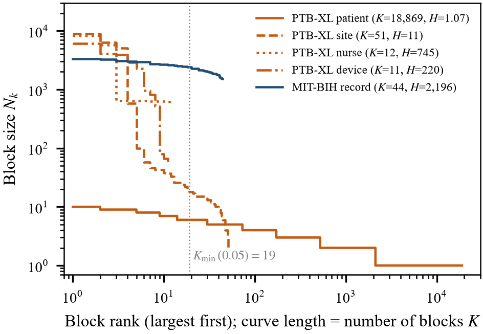

# §4 Audit Design

> **v7 — 2026-10-02.** Diparafrasekan penuh dari v6 (commit 3edc1f0). Semua angka dataset, split dan hiperparameter, Tabel 4.1–4.2 dan keterangan gambar alur tetap. **2026-10-03:** gambar alur audit didesain ulang dan dipindah ke §1 sebagai Fig. 1. **2026-10-03 (pemadatan 20 hal.):** Fig. 3 baru (geometri blok, `experiments/block_geometry.py` → `results/raw/block_geometry.json`, seluruh dataset); gambar lama 3–8 menjadi 4–9. Prosa dipadatkan; detail sentinel usia 300 dan cache atomik dibuang; baris Multiplicity digabung ke baris record-level di Tabel 4.2.

---

## 4. Audit Design

The audit has two stages (Fig. 1). The three diagnostics of §3 are first
evaluated from metadata, before any model is trained; naive split conformal (B1)
and HCP (B12) are then compared for coverage and set size on held-out blocks at
feasible levels, over 200 random block-level splits per configuration and three
backbones of 0.10 M, 7.2 M and 16.0 M parameters. The metadata diagnostics
involve no model and must agree across backbones, a negative control on the
pipeline. Throughout, what a dataset *documents* is kept apart from what can be
*observed* in it.

### 4.1 Datasets and dependence structures

The three datasets play different roles. Table 4.1 gives each role and the block
geometry that places the two primary datasets at opposite ends of the
design-effect axis.

**Table 4.1.** Roles and block geometry of the three datasets.

| | PTB-XL | MIT-BIH | Challenge 2021 |
|------------|------------------|------------------|------------------|
| Role | Primary case: patient-level dependence, multi-label targets, label hierarchy | Strong-dependence end of the design-effect axis | Case study at the limit of observability |
| Block identifier | Documented (`patient_id`) | Documented (record = subject) | Not documented |
| Block unit | patient | record (subject) | — |
| Calibration blocks $K_1$ | 958 | 11 | — |
| Harmonic mean block size $H$ | 1.05 | 1,355† | — |
| Design effect | **1.02** | **703.93**† | — |

PTB-XL: $K_1$ is half of the 1,917 fold-9 patients with a diagnostic superclass,
as split in the coverage experiments; $H$ and $\rho$ are computed over all 1,917.
† MIT-BIH: calibration records subsampled to a common 1,355 beats (§4.4), so the
design effect is that of the dose–response experiment at $p=0$; the native
harmonic mean is 2,196 over all 44 records (Fig. 3), and the coverage deficits of
§5.2–§5.3 use full-length records.

Block count and block size come as a package within any one dataset, so no
single dataset can separate their effects. Only the native block sizes are
structural: $K_1$ follows from the split design, and the design effect depends on
the model through the score ICC $\rho$. Challenge 2021 supports no claim of
generality; it is there because a diagnostic that only ever returns "admissible"
has not shown it can discriminate.

**PTB-XL.** Version 1.0.3 [H1], [H2] holds 21,799 twelve-lead records from 18,869
patients with full metadata under a permissive licence. We use the 100 Hz version
(1,000 samples per 10-second record), band-pass filtered at 0.5–40 Hz with a
zero-phase third-order Butterworth filter and z-normalized per lead and record.
A record receives a superclass when any diagnostic SCP statement of that class
appears in its annotation, regardless of likelihood: NORM (9,514), MI (5,469),
STTC (5,235), CD (4,898) and HYP (2,649), 27,765 labels in all, with 5,144
records carrying more than one. The 411 records (1.9%) without a diagnostic
superclass would be covered trivially under (5) and are excluded. Median age is
62, and 11,354 records are from male and 10,445 from female patients.

Patients contribute 1.155 records on average and at most 10; 88.8% contribute
one, and only 5,041 records (23.1%) come from patients with several. Three more
grouping variables, 51 recording sites (17 records missing), 12 nurses (1,473
missing) and 11 devices (none missing), cross rather than nest, the situation of
Corollary 2. Fig. 3 sets these groupings beside the MIT-BIH records: curve length
is the number of blocks, which governs feasibility, and height is block size,
which drives the design effect.

PTB-XL patient blocks are many and nearly singletons, whereas the other PTB-XL
sources and the MIT-BIH records give few blocks of hundreds to thousands of
observations. The stratified ten-fold split is used as released (17,418 records
in folds 1–8, 2,183 in fold 9, 2,198 in fold 10; no patient in two folds).
Cardiologists validated 67.0% of records in folds 1–8 (range 64–68%) but all
records in folds 9 and 10, so all analyses use fold 9; fold 10 is held in reserve
and has not been examined.

**MIT-BIH.** Version 1.0.0 [H3] holds 48 half-hour two-channel recordings at
360 Hz from 47 subjects, annotated beat by beat by cardiologists; the four paced
records (102, 104, 107, 217) are removed, leaving 44 records from 43 subjects. Mapping annotations to the five AAMI
classes gives 100,733 beats, each a window centered on its R peak, filtered as
for PTB-XL and z-normalized per beat. The 40 beats too close to a record boundary
for a full 256-sample (711 ms) window are dropped, leaving 100,693: N 90,087,
S 2,781, V 7,008, F 802 and Q 15, with Q kept and reported as degenerate. The
MLII lead is selected by name, because record 114 stores its channels as
`[V5, MLII]`. The inter-patient partition gives DS1 and DS2, 22 records each,
with 51,000 and 49,693 beats; records hold 1,517 to 3,361 beats (median 2,257),
three orders of magnitude more than a PTB-XL block. Records 201 and 202 come from
one subject but fall on opposite sides of the partition, so DS2 holds 22 distinct
subjects, one of whom also contributes record 201 to training; we keep the
standard split for comparability and disclose the leak. Below, a MIT-BIH block is
a record, and with this one exception a record is a subject.

**Challenge 2021.** The PhysioNet/CinC Challenge 2021 collection (version 1.0.3)
[H5] holds 66,416 records in seven non-duplicate source folders. No header field
in the sample we inspected is documented as a patient identifier, whereas
repetition is documented, so independent units are fewer than records and the
unobservable patient partition is no evidence of independence (Appendix C). The
only documented grouping, the source partition with $K=7$, gives
$\alpha_{\min}\ge 1/8$ by Proposition 1; source folders are not patient blocks,
and for the patient partition $K_1$ becomes an assumption that authors must
state.

### 4.2 Calibration and evaluation protocol

B1 is split conformal prediction calibrated as if records or beats were
exchangeable; B12 is HCP calibrated at the block level [A0]. We ask whether any
guarantee can be enforced, not which construction is most efficient, so the
constructions of Dunn et al. [A0b] and Mondrian conformal prediction are not
compared.

PTB-XL trains on folds 1–6, validates on fold 7 and splits the 1,917 fold-9
patients with a diagnostic superclass evenly into calibration and evaluation
halves (200–400 repetitions); fold 8 is left out for its different label quality.
The feasibility counts of §5.1 instead
treat all of fold 9 (2,183 records, 1,942 patients) as the calibration pool,
the largest pool the design allows; they answer whether any calibration could be
feasible, the coverage experiments what a realistic split delivers. MIT-BIH
trains on DS1 minus four validation records (124, 205, 215, 230), validates on
those four, and splits DS2 11/11 at the record level (200–400 repetitions).

Coverage is the fraction of held-out observations covered (beats for MIT-BIH,
records for PTB-XL), averaged over splits. This observation-weighted coverage is
the natural target of split conformal, whose nominal statement concerns one
exchangeable observation, whereas guarantee (2) concerns one observation from a
new block, whose empirical counterpart averages within each test block first.
The two coincide for equal block sizes and nearly so on PTB-XL; DS2 records
differ in length by up to a factor of 2.1, so both are reported there (§5.3). On
PTB-XL we report superset coverage (5), using the maximum score over the true
labels.

### 4.3 Models and conformity scores

Conformal validity does not depend on the model, so the backbone changes set
size, not coverage guarantees. The primary backbone, SmallECGNet, is a compact
1-D convolutional network (104,389 parameters for 12-lead input, 101,925 for one
lead), trained in an exploratory stage of this project and reused without
retraining. Each audit is repeated with two 1-D residual networks of the PTB-XL
benchmark family [F1], ResNet1D-34 (7,225,733 / 7,220,805 parameters) and
ResNet1D-50 (15,969,413 / 15,964,485). All three were trained with Adam
(learning rate $10^{-3}$), early stopping on validation loss (patience 5) and at
most 25 epochs on PTB-XL and 30 on MIT-BIH.
Losses are binary cross-entropy over the five superclasses (PTB-XL) and
cross-entropy over the five AAMI classes (MIT-BIH), without class weighting;
batches hold 128 records or 256 beats, accumulated for the residual networks from
micro-batches of 32 or 64, so batch-normalization statistics are per
micro-batch. The primary backbone reaches a macro-AUROC of 0.9016 on PTB-XL and,
on MIT-BIH, an accuracy of 0.8690 with balanced accuracy 0.3748 and macro-F1
0.3144. The backbones were deliberately not tuned for discrimination, because a
weak minority-class score enlarges sets without affecting the coverage under
audit. Scores are
$s(x,y)=1-\hat p_y(x)$ for multi-class MIT-BIH and $1-\hat\sigma_\ell(x)$ per
label for multi-label PTB-XL, where the superset score is the maximum over the
true labels and reduces to scalar HCP (§3.4).

### 4.4 Statistical analysis

Resampling acts on blocks (patients or records), never on single records or
beats, which would reproduce the error under study. Intervals over repeated
random splits of a fixed set of blocks describe the Monte Carlo variability of
the split procedure on those blocks; they narrow as splits are added and are not
confidence intervals for the patient population. For the central MIT-BIH
comparison we therefore also treat records as the sampling unit, through a
leave-one-record-out jackknife over the 22 DS2 records with Holm correction
across the three $\alpha$ levels of each backbone. This analysis was added after
the initial plan, once the distinction was noticed, but its specification was
committed before it was run. All analyses follow an internal, version-controlled
protocol, not publicly registered, whose deviation log records every departure
from the initial plan (§6.4). Friedman–Nemenyi tests, designed for many classifiers over many
datasets, are uninformative with two and are not used.

The three MIT-BIH controls are sketched in Fig. 7 (§5.3). The permutation null
applies one random permutation of record labels to DS2 beats, preserving every
block size, and shares its splits with the observed arm. The factorial design
crosses original and permuted membership with calibration records subsampled to
1,355 beats (60% of the mean record length) or to 60% of their own length, which
matches calibration size in expectation; test records are used in full. The
dose–response experiment permutes the record labels of a random fraction
$p\in\{0, 0.1,\dots,1\}$ of beats and subsamples calibration records to 1,355
beats. Intraclass correlations use the one-way ANOVA estimator for unbalanced
designs, $(\mathrm{MSB}-\mathrm{MSW})/\{\mathrm{MSB}+(N_0-1)\mathrm{MSW}\}$, on
conformity scores (on PTB-XL, the superset score of (5)); the indicator version
thresholds at the $(1-\alpha)$ quantile of all evaluation scores. Table 4.2 lists
the procedure behind each reported quantity.

**Table 4.2.** Statistical procedures.

| Quantity | Procedure |
|-------------|--------------------------------------|
| Coverage and set size | Mean over 200 random block-level splits; 2.5–97.5% range across splits |
| B1 deficit against the permutation null | Paired splits (200); Monte Carlo 95% interval from a percentile bootstrap of split-level coverage (4,000 resamples); one-sided bootstrap $p$, Holm across the three $\alpha$ levels of each backbone |
| B1 deficit, record level | Leave-one-record-out jackknife over the 22 DS2 records (500 paired splits per replicate, new permutation per replicate); $t$ interval with 21 df; one-sided $t$ test, Holm–Bonferroni across the three $\alpha$ levels of each backbone |
| Factorial effects | 400 splits; Monte Carlo 95% interval: percentile bootstrap (3,000 resamples) |
| Dose–response points | 300 splits per point; Monte Carlo 95% interval: percentile bootstrap (3,000 resamples) |
| Monotonicity in dependence | Spearman correlation across configurations (descriptive; points share the same records) |
| Sensitivity to checkpoint | Agreement of signs between best-validation and last-epoch weights |

### 4.5 Reproducibility

Experiments run on CPU (Intel Core i5-7200U, 2 threads) with Python 3.14.6,
PyTorch 2.14.0, NumPy 2.5.2, SciPy 1.18.1, scikit-learn 1.9.1, pandas 3.0.6 and
wfdb 4.3.1, with seed 0 throughout. Every reported number is stored with its
configuration as a JSON artifact.

---

## Catatan penyusunan

| Hal | Keputusan |
|---|---|
| Narasi sebelum float | Tabel 4.1, Tabel 4.2 didahului kalimat yang menyebut dan menjelaskan isinya; Fig. 1 kini di §1 |
| Kutipan langsung | INCART: tetap dalam tanda kutip |
