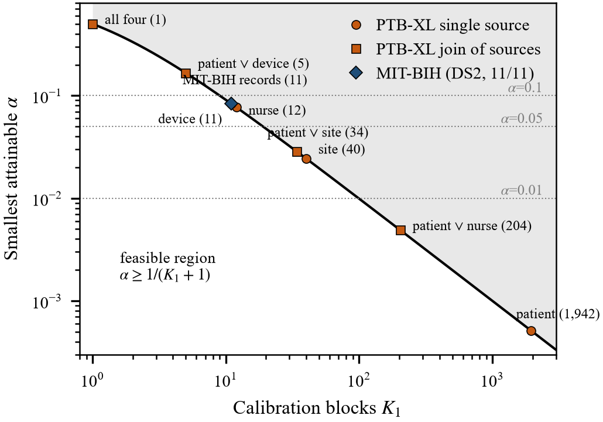
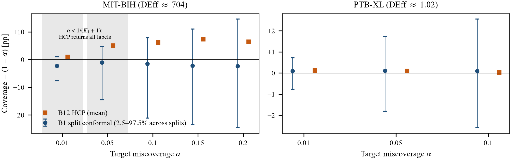
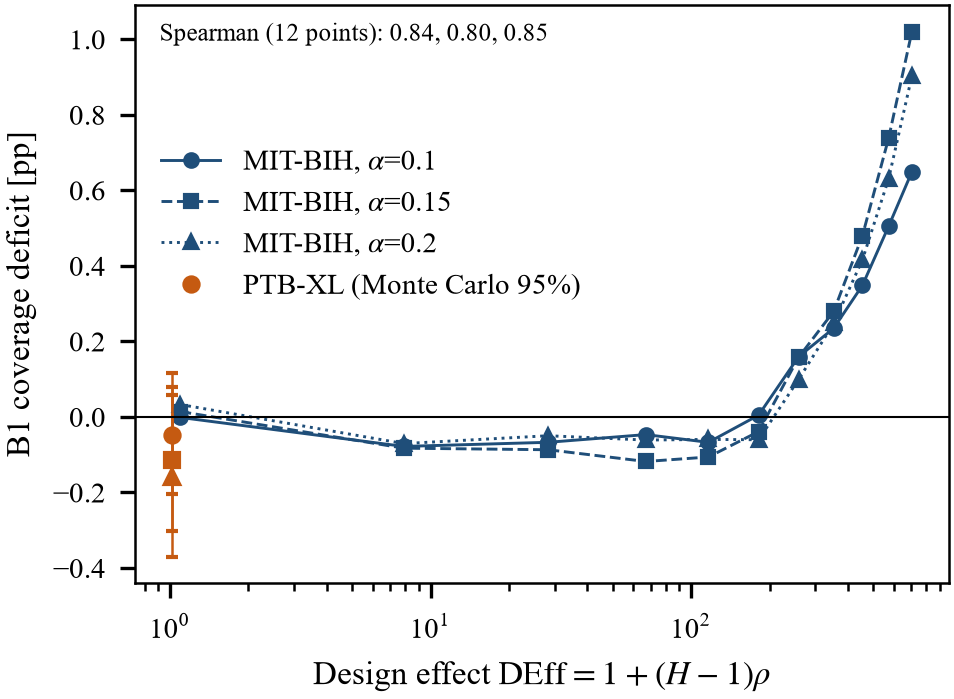

# §5 Results

> **v7 — 2026-10-02.** Prosa diparafrasekan penuh dari v6 (commit 3edc1f0). Isi Tabel 5.1–5.6 dan keterangan Fig. 4–8 tidak diubah. Fig. 9 kini dua panel: (a) defisit per backbone (gambar lama), (b) sensitivitas checkpoint 16 sel dari `*_terakhir.json` — sebelumnya hanya teks.

---

## 5. Results

Results follow the order of the audit: feasibility (§5.1), coverage (§5.2),
attribution (§5.3), dose–response (§5.4) and robustness (§5.5), with B1 and B12
as in §4.2 and $\alpha_{\min}=1/(K_1+1)$.

### 5.1 Feasibility is decided by the partition, not by the model

**Granularity.** In the PTB-XL calibration fold (fold 9, 2,183 records), patient
blocking is feasible at every conventional $\alpha$, and each coarser source
narrows the admissible range. Table 5.1 gives, per grouping, the calibration
blocks, $\alpha_{\min}$ and the conventional levels that remain attainable.

**Table 5.1.** HCP feasibility on PTB-XL fold 9 by grouping.

| Grouping | Blocks (all folds) | $K_1$ | Mean block size | $\alpha_{\min}$ | 0.01 | 0.05 | 0.10 | 0.20 |
|---|---:|---:|---:|---:|:-:|:-:|:-:|:-:|
| `patient_id` | 18,869 | 1,942 | 1.12 | 0.00051 | ✓ | ✓ | ✓ | ✓ |
| `site` | 51 | 40 | 54.55 | 0.02439 | — | ✓ | ✓ | ✓ |
| `nurse` | 12 | 12 | 163.42 | 0.07692 | — | — | ✓ | ✓ |
| `device` | 11 | 11 | 198.46 | 0.08333 | — | — | ✓ | ✓ |
| `strat_fold`† | 10 | 8 | 2,179.90 | 0.11111 | — | — | — | ✓ |

† Applicable only if calibration draws on folds 1–8.

The site row needs care. Of the 40 sites in fold 9, 37 occur only among the 223
records with an empty `nurse` field, while the 1,960 fully annotated records come
from just 3 sites, so site blocking is admissible only thanks to a minority of
incompletely annotated records that seem to stem from a different collection
regime.

**Crossed sources.** The PTB-XL sources cross: 46 patients appear at more than one
site, 247 with more than one nurse and 174 on more than one device. Respecting
several sources therefore means calibrating on their join, which coarsens fast.
Over all 2,183 records, patient and device together leave $K_1=5$
($\alpha_{\min}=0.167$), and all four sources leave one block
($\alpha_{\min}=0.5$). On the 1,960 records with complete metadata we enumerated
all 15 joins of the four declared sources; 8 meet the sufficiency condition, and
all 8 have $K_1=1$. *If patient, site, nurse, and device are all treated as
dependence sources, no admissible calibration grouping exists at any conventional
$\alpha$.* The statement is conditional on that declaration, which the data
cannot verify (§6.4); the tendency of joins to merge into a giant component is
known [P2]. Fig. 4 places the single sources, their joins and the MIT-BIH record
partition on the feasibility frontier.

**Labels.** Applied label by label, Proposition 3 shrinks the feasible region as
the hierarchy becomes finer. All superclasses pass, but 24 of the 44 SCP codes
fail at $\alpha=0.05$, `2AVB` occupies a single calibration block, and a
Bonferroni correction across labels makes 43 of 44 codes infeasible at a
family-wise $\alpha=0.05$. Table 5.2 counts the failing labels per level.

**Table 5.2.** PTB-XL labels failing Proposition 3 (fold 9, patient blocks).

| Level | Labels $m$ | $K_1(\ell)$ range | Fail at 0.01 | Fail at 0.05 | Fail at 0.10 | Fail at 0.05 / $m$ |
|---|---:|---:|---:|---:|---:|---:|
| Superclass | 5 | 242–905 | 0 | 0 | 0 | 0 |
| Subclass | 23 | 2–905 | 15 | 6 | 4 | 22 |
| SCP code | 44 | 1–905 | 36 | 24 | 12 | 43 |

The hierarchy was monotone in all 23 parent–child pairs, and MIT-BIH class Q is
confined to $K_1=2$ records ($\alpha_{\min}=0.333$). Fig. 5 resolves Table 5.2
label by label against the block counts required at $\alpha=0.05$ and $0.10$.

### 5.2 Coverage under block dependence

Over 200 block-level splits (§4.2), mean B1 coverage on MIT-BIH falls 1.0–2.4
percentage points below $1-\alpha$ at every level, while on PTB-XL it reaches or
exceeds nominal. Table 5.3 lists coverage and set size for both methods with the
primary backbones.

**Table 5.3.** Coverage (mean, 2.5–97.5% range across splits) and mean set size.

| Dataset | $\alpha$ | B1 coverage | B12 coverage | $\lvert C\rvert$ B1 | $\lvert C\rvert$ B12 |
|---|---:|---|---:|---:|---:|
| MIT-BIH | 0.01‡ | 0.9673 [0.9137, 0.9997] | 1.0000 | 2.695 | 5.000 |
| | 0.05‡ | 0.9398 [0.8045, 0.9974] | 1.0000 | 1.690 | 5.000 |
| | 0.10 | 0.8851 [0.6887, 0.9788] | 0.9615 | 1.051 | 2.434 |
| | 0.15 | 0.8279 [0.6151, 0.9602] | 0.9234 | 0.924 | 1.443 |
| | 0.20 | 0.7764 [0.5542, 0.9462] | 0.8642 | 0.834 | 1.001 |
| PTB-XL | 0.01 | 0.9910 [0.9823, 0.9972] | 0.9912 | 3.769 | 3.788 |
| | 0.05 | 0.9511 [0.9318, 0.9673] | 0.9510 | 2.741 | 2.742 |
| | 0.10 | 0.9010 [0.8741, 0.9256] | 0.9002 | 2.248 | 2.240 |

‡ Below $\alpha_{\min}=1/12$: HCP returns the full label set for every test beat.

Still, on MIT-BIH the range across splits contains $1-\alpha$ at every level: with
11 test records no single split can expose a deficit of this size, and comparing
means is not a test. Set size has to accompany any reading of B12 coverage. At
$\alpha=0.10$ HCP covers 0.9615 of beats with sets of 2.43 labels out of 5,
whereas B1 needs 1.05, and below $\alpha_{\min}$ its perfect coverage amounts to
abstention. Fig. 6 shows both points,
plotting each method's gap to nominal and shading the levels below
$\alpha_{\min}$.

### 5.3 The deficit is attributable to dependence

**Permutation null.** To test whether dependence causes B1 to under-cover, we
compared it with a matched null that permutes the assignment of beats to records
within DS2. The permutation keeps $K_1=11$, the multiset of block sizes and the
marginal score distribution unchanged, while the score ICC drops from 0.519 to
0.000. Table 5.4 reports the B1 deficit against this null at two levels of
uncertainty. Over 200 paired splits of the 22 DS2 records the deficit is positive
in all nine backbone×$\alpha$ cells, and for the primary backbone its Monte Carlo
interval excludes zero at all three levels, but these intervals describe the
split procedure on these records only (§4.4). With records as the sampling unit,
the leave-one-record-out jackknife gives deficits of 0.60–1.83 pp with 95%
intervals of half-width 3.7–5.7 pp, all including zero (Holm-adjusted one-sided
$p\ge0.59$). On these 22 subjects B1 covers less than the null in every
configuration, but 22 subjects are too few to establish the sign of the deficit
for the population they represent.

**Table 5.4.** MIT-BIH B1 deficit against the permutation null (pp): Monte Carlo interval over 200 paired splits of the 22 DS2 records, and record-level jackknife 95% CI with Holm-adjusted one-sided p (Table 4.2).

| Backbone | ICC | $\alpha$ | Deficit [Monte Carlo 95%] | Record level [95% CI] | Holm $p$ |
|------------|-----|-----|----------------------|------------------------|--------|
| SmallECGNet | 0.519 | 0.10 | +1.49 [0.34, 2.71] | +1.26 [−2.70, +5.22] | 0.77 |
| | | 0.15 | +2.21 [0.85, 3.60] | +1.36 [−3.21, +5.93] | 0.77 |
| | | 0.20 | +2.37 [0.79, 3.93] | +1.02 [−4.67, +6.71] | 0.77 |
| ResNet1D-34 | 0.436 | 0.10 | +1.15 [0.10, 2.23] | +1.55 [−2.15, +5.26] | 0.59 |
| | | 0.15 | +1.02 [−0.16, 2.23] | +1.14 [−3.36, +5.63] | 0.60 |
| | | 0.20 | +0.81 [−0.59, 2.17] | +0.60 [−4.44, +5.65] | 0.60 |
| ResNet1D-50 | 0.462 | 0.10 | +2.54 [1.25, 3.87] | +1.72 [−3.70, +7.14] | 0.68 |
| | | 0.15 | +3.42 [1.91, 4.98] | +1.83 [−3.16, +6.81] | 0.68 |
| | | 0.20 | +3.18 [1.54, 4.82] | +1.17 [−4.07, +6.42] | 0.68 |

**Weighting.** Averaging within each test record before averaging over records,
the empirical counterpart of (2), leaves these findings intact (same jackknife
runs, full data). Block-weighted B1 coverage is below its observation-weighted
value in all nine cells, and the deficit against the null becomes 1.43–2.61 pp.
Block-weighted HCP coverage stays above $1-\alpha$ for every level and backbone
(0.9531–0.9548 at $\alpha=0.10$, 0.9146–0.9178 at 0.15 and 0.8557–0.8565 at
0.20), as guarantee (2) requires.

The same control explains why a B12-against-B1 comparison is uninformative. Define the
mechanical share as the B12−B1 gap in the permuted arm divided by the gap on the
original data. It lies between 81% and 107%: removing dependence barely changes
the gap, and at $\alpha=0.10$ the gap is slightly wider without dependence,
because the finite-block correction pushes HCP to the $(1-\alpha)(K_1+1)/K_1$
quantile regardless. "B12 improves on B1" was therefore withdrawn as a criterion
(§6.4), and the deficit against the permutation null is the evidence used
throughout.

**Factorial decomposition.** A 2×2 design crossed clustering (original versus
randomized record membership) with block-size balance (balanced versus
imbalanced), calibration size matched in expectation (§4.4). Clustering lowered
coverage by 1.22, 1.55 and 1.49 pp at $\alpha=0.10, 0.15, 0.20$, with Monte Carlo
intervals over 400 splits that exclude zero (e.g. $[-1.84, -0.63]$ pp at 0.10).
The imbalance main effect was smaller (−0.44, −0.26, −0.27 pp) and acted mainly
through clustering: at $\alpha=0.10$ imbalance lowered coverage by 0.83 pp with
clustered records but by 0.04 pp with randomized membership (interaction
−0.79 pp; −0.54 and −0.52 pp at the other levels), as the pooled design effect in
(4), which grows with $\sum_k N_k^2$ only when $\rho>0$, anticipates. Imbalance
thus amplifies clustering rather than producing the deficit itself. As in
Table 5.4, these intervals are conditional on the 22 DS2 records. Fig. 7 sets the
two controls side by side: clustering dominates in panel (a), and in panel (b) the
B12−B1 gap keeps nearly its full size once dependence is permuted away.

### 5.4 The deficit tracks the design effect

To vary dependence within one dataset, we moved a fraction $p$ of MIT-BIH beats
to randomly chosen records and subsampled every calibration record to 1,355
beats, removing calibration-block imbalance (11 values of $p$, 300 splits each;
test records used in full). Between $p=0$ and $p=1$ the score ICC drops from
0.519 to 0.0001. With equal calibration sizes the deficits are smaller than in §5.3
(0.65 pp at $p=0$, $\alpha=0.10$) and every per-point Monte Carlo interval
includes zero, so the evidence lies in the trend, summarized by Spearman
correlations. These replace the cross-dataset test of the initial protocol
(§6.4) and are descriptive: all points come from the same 22 records, so their
$p$-values, which treat points as independent, are not population inference.
Table 5.5 reports the correlations on three dependence axes; within MIT-BIH the
deficit grows with ICC at all three levels.

**Table 5.5.** Spearman correlation between dependence and coverage deficit (p-values treat points as independent).

| Axis | Points | $\alpha=0.10$ | $\alpha=0.15$ | $\alpha=0.20$ |
|---|---:|---|---|---|
| Score ICC, MIT-BIH only | 11 | 0.88 ($p=0.0003$) | 0.78 ($p=0.0045$) | 0.80 ($p=0.0031$) |
| DEff, MIT-BIH + PTB-XL | 12 | 0.84 ($p=0.0006$) | 0.80 ($p=0.0016$) | 0.85 ($p=0.0005$) |
| Indicator DEff, MIT-BIH + PTB-XL | 12 | 0.90 ($p<0.0001$) | 0.80 ($p=0.0016$) | 0.71 ($p=0.010$) |

On the ICC axis alone PTB-XL does not fit: its patient-level ICC of 0.352 matches
a MIT-BIH point with a 0.35 pp deficit, yet PTB-XL shows none. The design effect
resolves this. With $H=1.05$, PTB-XL has a DEff of 1.02 against 704 for intact
MIT-BIH, and on this axis the combined correlation stays positive (0.80–0.85);
using the ICC of the coverage indicator at a fixed threshold, the quantity in the
variance of §3.2, does not change the conclusion. DEff is a summary axis, not a
sufficient statistic; an exceedance-specific design effect is given in [P1].
Fig. 8 plots the deficit against DEff: the MIT-BIH gradient carries the combined
correlation, and PTB-XL serves as a prediction check at the low-dependence end
rather than an independent trend (§6.4), with deficits of −0.05, −0.12 and
−0.16 pp, i.e. coverage slightly above nominal.

### 5.5 Robustness to backbone and checkpoint

**Backbone.** The residual networks, with about 70 and 155 times as many
parameters, improved discrimination only unevenly: MIT-BIH balanced accuracy
stayed at 0.370–0.376 and PTB-XL macro-AUROC fell slightly. As the negative
control requires, $K_1(\ell)$ was identical across backbones on both datasets.
Table 5.6 gives the discrimination of the three backbones.

**Table 5.6.** Discrimination by backbone.

| Backbone | Parameters (MIT-BIH / PTB-XL) | MIT-BIH accuracy | MIT-BIH balanced acc. | PTB-XL macro-AUROC |
|---|---|---:|---:|---:|
| SmallECGNet | 101,925 / 104,389 | 0.869 | 0.375 | 0.902 |
| ResNet1D-34 | 7,220,805 / 7,225,733 | 0.922 | 0.376 | 0.897 |
| ResNet1D-50 | 15,964,485 / 15,969,413 | 0.926 | 0.370 | 0.896 |

On PTB-XL, B1 reached nominal coverage in all 9 backbone×$\alpha$ cells, 0.05–0.19
pp above nominal on average. On MIT-BIH the deficit against the permutation null
is positive in all 9 cells (Table 5.4); its Monte Carlo interval excludes zero in
7, the exceptions being ResNet1D-34 at $\alpha=0.15$ and $0.20$, where the deficit
is smallest (0.81–1.02 pp), and at the record level in none. Across backbones the
mechanical share of the B12−B1 gap ranged from 75% to 110%.

**Checkpoint.** With only 4 MIT-BIH validation records, early stopping chose
epoch 1 for ResNet1D-50, so we reran the audit with last-epoch weights for both
residual networks on both datasets (MIT-BIH epochs 13 vs. 8 and 6 vs. 1; PTB-XL
14 vs. 9 and 12 vs. 7). In all 16 backbone×dataset×$\alpha$ cells the B1 deficit
kept its sign and $K_1(\ell)$ was unchanged, but on MIT-BIH its size shifted by up
to 1.8 pp, enough to reorder the backbones, so differences in deficit size
between backbones are not interpreted. Fig. 9 summarizes both checks. Panel (a)
sets the Monte Carlo intervals of Table 5.4 against the record-level intervals:
the direction holds for every backbone, but only the narrower, conditional
intervals exclude zero. Panel (b) shows every cell staying in the quadrant of its
original sign under both checkpoints.

---

## Catatan penyusunan

| Hal | Keputusan |
|---|---|
| Sumber angka | 5.1: `feasibility_alpha.json`, `corollary32_lattice.json`, `label_feasibility.json` · 5.2: `backbone_invariance/{mitdb,ptbxl}_small.json` · 5.3: `control_permutation_mitdb.json`, `factorial_mitdb.json` · 5.4: `dose_response.json`, `monotonicity_icc_mitdb.json`, `robustness_indicator_icc.json` · 5.5: `backbone_invariance/*.json` (+ `*_terakhir.json`), `control_permutation_mitdb_resnet1d*.json` |
| Fig. 9b | 16 sel = 2 backbone residual × (5 α MIT-BIH + 3 α PTB-XL); tanda sama di 16/16; selisih maks MIT-BIH 1,82 pp |
| Konvensi tanda | Defisit positif = kurang-cakup |
