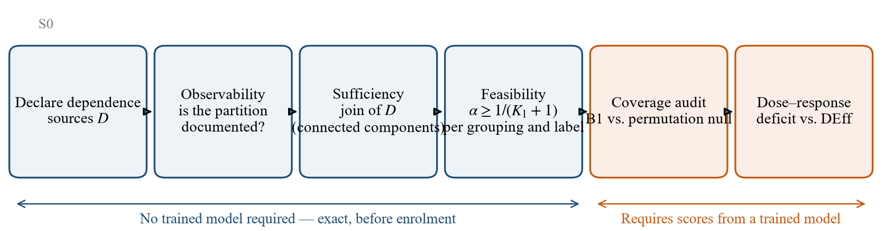

# §5 Methods — Feasibility Diagnostics and Audit Protocol

> **v3 — 2026-10-02.** Ditulis ulang dan dipadatkan (1.548 → ±1.050 kata). Persamaan (6)–(7), Asumsi (A), Tabel 5.1, Proposisi 3, contoh kontra bobot, 15,7 dan 1,000 dipertahankan. Hasil PTB-XL ($K_1=34$, 5, 1) dipindah seluruhnya ke §8.1/§10.5 — tempatnya di Hasil, bukan Metode. Versi sebelumnya: `sec5-draft.md` di riwayat git (commit 9098746).

---

## 5. Methods

We audit an existing procedure, HCP [A0], with three diagnostics assembled from
established results, and cite the source of each where it is introduced so that
borrowed tools are not mistaken for findings. $K_1$ is the number of
**calibration** blocks, $N_k$ the size of block $k$, $n=\sum_k N_k$, and $H$ the
harmonic mean of the $N_k$; $\rho(t)$ is the intraclass correlation of the
indicator $\mathbb{1}\{s\le t\}$ at threshold $t$, not of the raw score.

### 5.1 Whether a finite threshold exists, and how precise it is

#### 5.1.1 Existence

Proposition 1 restates a consequence of the $+\infty$ atom in Theorem 1 of [A0]
in a form that can be checked from metadata, and we claim nothing beyond that.
For the audit, two of its features matter: the boundary does not involve $N_k$
(Corollary 1.1), and it is not strict, so a grouping lying exactly on it is
feasible.

#### 5.1.2 Precision under a compound-symmetric model

This subsection is **not** distribution-free. It requires **Assumption (A)**:
blocks are independent and identically distributed, and every pair of indicators
within a block has the same correlation $\rho(t)$, which does not depend on $N_k$
(compound symmetry). The HCP threshold is determined by
$\hat G(t)=\frac{1}{K_1}\sum_k \bar F_k(t)$, the unweighted mean of block-level
empirical CDFs, whose variance under (A) is the standard one for an unweighted
mean of cluster means [I2]:

$$
\operatorname{Var}\big(\hat G(t)\big) \;=\; \frac{\sigma^2(t)\,[\,1+(H-1)\rho(t)\,]}{K_1 H},
\qquad \sigma^2(t)=F(t)\{1-F(t)\}.
\tag{6}
$$

As $N_k\to\infty$ the variance tends to $\sigma^2\rho/K_1$. This floor belongs to
compound symmetry, not to clustered data in general: if correlation decays with
separation, as plausibly holds for consecutive beats in a long Holter record, the
mean pairwise correlation can shrink with $N_k$ and the floor disappears. We make
no claim outside (A).

#### 5.1.3 The equal weighting is imposed, not chosen

The variance (6) belongs to the block-weighted estimator. The Kish effective
sample size describes an observation-weighted estimator, and the two coincide
only for uniform block sizes:

$$
\mathrm{DEff}_{\text{block}}(\rho)=\frac{n[1+(H-1)\rho]}{K_1H},
\qquad
\mathrm{DEff}_{\text{pooled}}(\rho)=1+\Big(\frac{\sum_k N_k^2}{n}-1\Big)\rho .
\tag{7}
$$

The second is the standard clustering design effect for unequal cluster sizes,
and comparing equal with size weighting of cluster means is established practice
in cluster-randomized trials [I1, A13]. What changes in the conformal setting is
the freedom to choose. In a trial, equal weighting is an analyst's choice, known
to be inefficient under unequal cluster sizes and usually replaced by
minimum-variance weighting [I1, A13]. In HCP it follows from the structure of the
threshold, and departing from it can break the guarantee rather than merely cost
efficiency. With $K_1=2$ singleton blocks and $\alpha=1/3$, HCP puts mass
$\tfrac13$ on each calibration score and on $+\infty$, giving threshold
$\max(s_1,s_2)$ and coverage exactly $\tfrac23$; moving the mass to
$(\tfrac23,0)$ while keeping $\tfrac13$ on $+\infty$ makes the threshold $s_1$,
and for continuous exchangeable scores the coverage falls to
$\mathbb{P}(s_0\le s_1)=\tfrac12<\tfrac23$. The practitioner is thus held to the
estimator that cluster-sampling theory finds most affected by block imbalance,
without its usual remedy. We report this as an observation and do not prove that
equal weights are the only valid choice. On PTB-XL the two design effects differ
by a factor of 15.7 at the site level; on `strat_fold`, whose blocks are nearly
uniform by construction, the ratio is 1.000, an internal check of the computation.

#### 5.1.4 The axis used to organize results

To compare datasets with very different block geometry we use the factor
$\mathrm{DEff}=1+(H-1)\rho$ of (6). Because $H$ enters only through $(H-1)\rho$, it
predicts that dependence is harmless whenever blocks are near-singleton, however
strong the within-block correlation — the opposite of what raw $\rho$ suggests. The
primary analysis computes $\rho$ from conformity scores; because (6) is stated for
the threshold indicator, we repeat it with $\rho(t)$ (§8.4). When the axis was
adopted is recorded in §10.6. We use it only to order configurations, not as a
calibrated effective sample size. Noonan derives a closed-form effective sample
size for thresholds under clustering and shows that the correction currently used
in the conformal literature is the wrong quantity [P1]; our axis shares its central
ingredient, the correlation of threshold indicators, but is a heuristic under (A),
and we defer to that work for the principled quantity.

### 5.2 Which calibration groupings are admissible

A calibration grouping $g$ must meet two conditions (Table 5.1).

**Table 5.1.** Admissibility conditions for a calibration grouping $g$.

| | Condition | Character |
|---|---|---|
| **S1** Feasibility | $K_1(g) \ge \lceil 1/\alpha\rceil - 1$ | exact, from Proposition 1 |
| **S2** Sufficiency | every **declared** dependence source is nested within $g$ | exact, given the declaration |

S1 alone is not enough, since a grouping can admit a finite threshold while
leaving dependence unaccounted for across its blocks. S2 is only as complete as
the list of sources supplied to it: an undeclared source passes vacuously, so S2
checks the consistency of a stated assumption rather than testing it. When
declared sources are crossed, the finest grouping satisfying S2 is their join
(Proposition 2). That joining individually fine groupings can produce a giant
component has been reported for leakage control [P2]. Combined with Proposition 1
it gives the design-level bound of Corollary 2.2, stated for the HCP family only.
The consequence differs in kind from the leakage setting: there a collapsed join
degrades a split, whereas here, below $1/(K_1+1)$, no finite threshold exists.
Because the declared set cannot be verified from data, we report every verdict as
a function of that set and never as a property of a dataset.

### 5.3 Per-label feasibility on a label hierarchy

Superset coverage (4) reduces exactly to HCP, so no new guarantee is involved
there. Label-conditional coverage (5) is different. That rare classes starve
class-conditional calibration is well established for exchangeable data [A12];
under hierarchical dependence the unit to be counted becomes the block.

**Proposition 3 (necessary condition).** *A finite per-label HCP threshold for
label $\ell$ at level $\alpha$ requires $\alpha \ge \tfrac{1}{K_1(\ell)+1}$, where
$K_1(\ell)$ is the number of calibration blocks containing at least one instance
of $\ell$.*

The condition is necessary, not sufficient. Conditioning a test observation on
carrying $\ell$ selects its block with probability proportional to the fraction
of $\ell$-positive observations in that block, whereas a block enters the
calibration stratum merely by containing one. Unless that fraction is constant
across blocks, test and calibration blocks are not exchangeable, and the rank
argument does not deliver $\mathbb{P}(\ell\in\hat C\mid\ell\in Y)\ge1-\alpha$. The
same size-biased selection arises for thresholds under clustering [P1]. We
therefore use Proposition 3 only to rule out guarantees, never to certify them.
Since every block containing a label also contains its ancestors, $K_1(\ell)$ is
monotone toward the root, and the condition fails along a frontier in the
taxonomy that can be mapped from metadata. Controlling $m$ labels jointly by a
union bound raises the requirement to $K_1(\ell)\ge\lceil m/\alpha\rceil-1$ for
every $\ell$.

### 5.4 Audit protocol

Fig. 1 summarizes the protocol. The three diagnostics are computed from metadata
before training; the empirical audit then measures the coverage and set size of
naive split conformal (B1) and HCP (B12) on held-out blocks over 200 random
block-level splits per configuration, repeated on three backbones of 0.10 M,
7.2 M and 16.0 M parameters. Metadata diagnostics — $K_1$, $K_1(\ell)$ and the join
structure — must then be identical across backbones, a negative control on the
pipeline. PTB-XL fold 10 is never used.

---

## Catatan penyusunan

| Alat di §5 | Rujukan | Kami klaim |
|---|---|---|
| Prop. 1 | [A0] Teorema 1 | hanya penyajian dapat-diperiksa |
| Varians $\hat G$, rata-rata harmonik | [I2] | — |
| $\mathrm{DEff}$ pooled; bobot sama vs ukuran | [I1, A13] | **pengamatan**: pada HCP bobot sama dipaksakan |
| ESS untuk ambang; seleksi berbobot-ukuran | [P1] | sumbu kami hanya heuristik pengurut |
| Join, komponen terhubung | baku, tanpa sitasi | — |
| Keruntuhan join | [P2] | **pengamatan**: akibatnya kategoris pada HCP |
| Prop. 3 | [A12] (versi exchangeable) | satuan hitung = blok; **perlu saja** |

**Wajib sebelum submit:** baca teks penuh I1, I2 dan P1 §2 (lihat `outline.md` R6).
