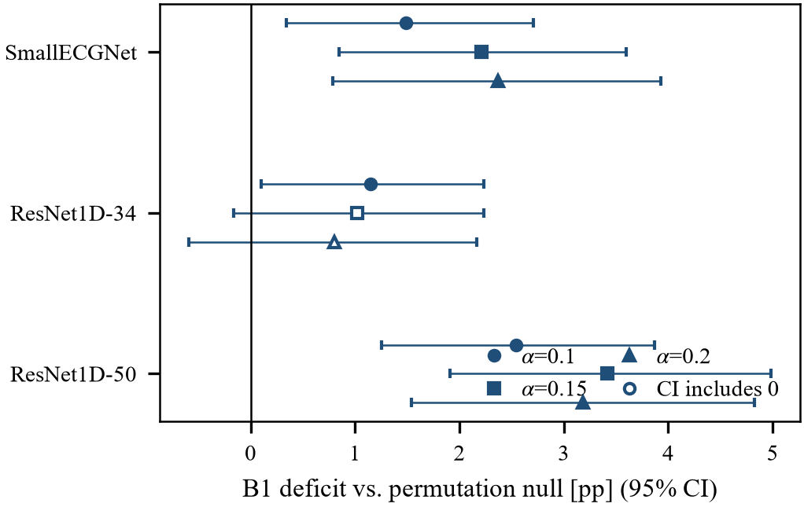

# §8 Results

> **v3 — 2026-10-02.** Ditulis ulang dan dipadatkan (1.624 → ±1.250 kata prosa). **Semua tabel (8.1–8.6) dan keterangan figure tidak diubah.** Prosa yang hanya mengulang nilai tabel diringkas. Semua angka dibaca dari `results/raw/*.json`. Versi sebelumnya: `sec8-draft.md` di riwayat git (commit 9098746).

---

## 8. Results

Results follow the order of the audit, from metadata-only feasibility (§8.1) to
coverage (§8.2), attribution (§8.3), dose–response (§8.4) and robustness (§8.5);
B1 and B12 are defined in §7.4, and $\alpha_{\min}=1/(K_1+1)$.

### 8.1 Feasibility is decided by the partition, not by the model

**Granularity.** On the PTB-XL calibration fold (fold 9, 2,183 records), patient
blocking is feasible at every conventional $\alpha$, whereas every coarser source
narrows the admissible range (Table 8.1).

**Table 8.1.** Feasibility of HCP on PTB-XL fold 9 by grouping.

| Grouping | Blocks (all folds) | $K_1$ | Mean block size | $\alpha_{\min}$ | 0.01 | 0.05 | 0.10 | 0.20 |
|---|---:|---:|---:|---:|:-:|:-:|:-:|:-:|
| `patient_id` | 18,869 | 1,942 | 1.12 | 0.00051 | ✓ | ✓ | ✓ | ✓ |
| `site` | 51 | 40 | 54.55 | 0.02439 | — | ✓ | ✓ | ✓ |
| `nurse` | 12 | 12 | 163.42 | 0.07692 | — | — | ✓ | ✓ |
| `device` | 11 | 11 | 198.46 | 0.08333 | — | — | ✓ | ✓ |
| `strat_fold`† | 10 | 8 | 2,179.90 | 0.11111 | — | — | — | ✓ |

† Applicable only if calibration draws on folds 1–8.

The site-level result needs a qualification. Of the 40 sites in fold 9, 37 occur
only among the 223 records whose `nurse` field is empty, while the 1,960 records
with complete metadata come from 3 sites. Site-level blocking is therefore
admissible only because of a metadata-incomplete minority that appears to come
from a different collection regime. Fig. 2 places every grouping, the joins below
and the MIT-BIH record partition on the feasibility frontier.

**Crossed sources.** The PTB-XL sources are crossed: 46 patients span more than
one site, 247 more than one nurse and 174 more than one device. Controlling
several sources therefore requires their join, which coarsens quickly. On all
2,183 records, patient and device together leave $K_1=5$ ($\alpha_{\min}=0.167$),
and all four sources leave a single block ($\alpha_{\min}=0.5$). On the 1,960
records with complete metadata we enumerated all 15 joins of the four declared
sources: 8 satisfy sufficiency, and all 8 have $K_1=1$. *If patient, site, nurse,
and device are all treated as dependence sources, no admissible calibration
grouping exists at any conventional $\alpha$.* This conclusion holds only for
that declaration, which cannot be verified from data (§10.5); the collapse of
joined partitions into a giant component is itself known [P2].

**Labels.** For label-conditional coverage the necessary condition of
Proposition 3 applies per label, and the feasible region shrinks as the hierarchy
is refined (Table 8.2, Fig. 3): every superclass is feasible, but 24 of 44 SCP
codes fail at $\alpha=0.05$, `2AVB` has a single calibration block, and with a
Bonferroni requirement across labels 43 of 44 codes are infeasible at a
family-wise $\alpha=0.05$. Monotonicity along the hierarchy held in all 23
parent–child pairs, and MIT-BIH class Q occupies $K_1=2$ records
($\alpha_{\min}=0.333$).

**Table 8.2.** Labels failing the necessary condition $\alpha\ge 1/(K_1(\ell)+1)$, PTB-XL fold 9, patient blocks.

| Level | Labels $m$ | $K_1(\ell)$ range | Fail at 0.01 | Fail at 0.05 | Fail at 0.10 | Fail at 0.05 / $m$ |
|---|---:|---:|---:|---:|---:|---:|
| Superclass | 5 | 242–905 | 0 | 0 | 0 | 0 |
| Subclass | 23 | 2–905 | 15 | 6 | 4 | 22 |
| SCP code | 44 | 1–905 | 36 | 24 | 12 | 43 |

None of these results involves a trained model; given the declared sources they
are exact and can be computed before any patient is enrolled.

### 8.2 Coverage under block dependence

Table 8.3 and Fig. 4 give coverage and set size for the primary backbones over
200 block-level splits (§7.2).

**Table 8.3.** Coverage (mean over splits, with 2.5–97.5% range across splits) and mean set size.

| Dataset | $\alpha$ | B1 coverage | B12 coverage | $\lvert C\rvert$ B1 | $\lvert C\rvert$ B12 |
|---|---:|---|---:|---:|---:|
| MIT-BIH | 0.01‡ | 0.9673 [0.9137, 0.9997] | 1.0000 | 2.695 | 5.000 |
| | 0.05‡ | 0.9398 [0.8045, 0.9974] | 1.0000 | 1.690 | 5.000 |
| | 0.10 | 0.8851 [0.6887, 0.9788] | 0.9615 | 1.051 | 2.434 |
| | 0.15 | 0.8279 [0.6151, 0.9602] | 0.9234 | 0.924 | 1.443 |
| | 0.20 | 0.7764 [0.5542, 0.9462] | 0.8642 | 0.834 | 1.001 |
| PTB-XL | 0.01 | 0.9910 [0.9823, 0.9972] | 0.9912 | 3.769 | 3.788 |
| | 0.05 | 0.9511 [0.9318, 0.9673] | 0.9510 | 2.741 | 2.742 |
| | 0.10 | 0.9010 [0.8741, 0.9256] | 0.9002 | 2.248 | 2.240 |

‡ Below $\alpha_{\min}=1/12$: HCP returns the full label set for every test beat.

On MIT-BIH the mean B1 coverage falls 1.0–2.4 percentage points below $1-\alpha$
at every level; on PTB-XL it is at or above nominal. On MIT-BIH, however, the
split-to-split range contains $1-\alpha$ at every level: with 11 test records no
single split can reveal a deficit of this size, so comparing means is not a test.
B12 coverage must be read with set size — at $\alpha=0.10$ HCP reaches 0.9615
with 2.43 of 5 labels, against 1.05 for B1, and below $\alpha_{\min}$ its perfect
coverage is abstention.

### 8.3 The deficit is attributable to dependence

**Permutation null.** To test whether B1 under-covers because of dependence, we
compared it with a matched null in which beat-to-record assignments in DS2 were
permuted. The permutation preserves $K_1=11$, the multiset of block sizes and the
marginal score distribution exactly, while reducing the score ICC from 0.519 to
0.000. Relative to this null the B1 deficit is positive at all three feasible
levels and significant at each after Holm correction across levels (Table 8.4,
first row; adjusted one-sided $p\le 0.0075$).

**Table 8.4.** MIT-BIH: B1 deficit against the permutation null, pp [95% CI], with the number of levels significant by 95% CI and after Holm correction.

| Backbone | Score ICC | $\alpha=0.10$ | $\alpha=0.15$ | $\alpha=0.20$ | CI | Holm |
|---|---:|---|---|---|:-:|:-:|
| SmallECGNet | 0.519 | +1.49 [0.34, 2.71] | +2.21 [0.85, 3.60] | +2.37 [0.79, 3.93] | 3/3 | 3/3 |
| ResNet1D-34 | 0.436 | +1.15 [0.10, 2.23] | +1.02 [−0.16, 2.23] | +0.81 [−0.59, 2.17] | 1/3 | 0/3 |
| ResNet1D-50 | 0.462 | +2.54 [1.25, 3.87] | +3.42 [1.91, 4.98] | +3.18 [1.54, 4.82] | 3/3 | 3/3 |

The same control shows why comparing B12 with B1 is uninformative. We define the
mechanical share as the ratio of the B12−B1 gap in the permuted arm to the gap on
the original data. It ranges from 81% to 107%: the gap barely changes once
dependence is removed, and at $\alpha=0.10$ it is slightly larger without
dependence than with it. HCP's finite-block correction forces it to the
$(1-\alpha)(K_1+1)/K_1$ quantile regardless of dependence. We therefore withdrew
"B12 improves on B1" as a criterion (§10.4) and rely throughout on the deficit
against the permutation null.

**Factorial decomposition.** A 2×2 design crossed clustering (original vs.
randomized record membership) with block-size balance (balanced vs. imbalanced)
at fixed calibration size. Clustering reduced coverage by 1.22, 1.55 and 1.49 pp at
$\alpha=0.10, 0.15, 0.20$, with intervals excluding zero at every level
(e.g. $[-1.84, -0.63]$ pp at 0.10), whereas neither the imbalance effect
(−0.44, −0.26, −0.27 pp) nor the interaction was significant at any level.
Block-size imbalance, a plausible alternative explanation, does not account for
the deficit.

### 8.4 The deficit tracks the design effect

To vary dependence within one dataset, we reassigned a fraction $p$ of MIT-BIH
beats to random records while holding blocks at a uniform 1,355 beats, so that
imbalance plays no part (11 values of $p$, 300 splits each). The score ICC falls
from 0.519 at $p=0$ to 0.0001 at $p=1$. With uniform blocks and subsampled
calibration, deficits here are smaller than in §8.3 (0.65 pp at $p=0$,
$\alpha=0.10$), and every per-point interval contains zero, so the evidence lies
in the trend tested by the pre-registered Spearman criterion (Table 8.5). Within
MIT-BIH the deficit rises with ICC at all three levels.

**Table 8.5.** Spearman correlation between dependence and coverage deficit.

| Axis | Points | $\alpha=0.10$ | $\alpha=0.15$ | $\alpha=0.20$ |
|---|---:|---|---|---|
| Score ICC, MIT-BIH only | 11 | 0.88 ($p=0.0003$) | 0.78 ($p=0.0045$) | 0.80 ($p=0.0031$) |
| DEff, MIT-BIH + PTB-XL | 12 | 0.84 ($p=0.0006$) | 0.80 ($p=0.0016$) | 0.85 ($p=0.0005$) |
| Indicator DEff, MIT-BIH + PTB-XL | 12 | 0.90 ($p<0.0001$) | 0.80 ($p=0.0016$) | 0.71 ($p=0.010$) |

ICC does not place PTB-XL on the same axis: its patient-level ICC of 0.352 matches
a MIT-BIH point with a deficit of 0.35 pp, yet PTB-XL shows none. The design
effect does. With $H=1.05$, PTB-XL has a DEff of 1.02, against 704 for intact
MIT-BIH, and on this axis the combined correlation stays positive and significant
(Fig. 5). We use DEff as a summary axis, not a sufficient statistic; see [P1] for
an exceedance-specific design effect. Recomputing the curve with the ICC of the
coverage indicator at a fixed threshold, the quantity that (6) actually involves,
leaves the conclusion unchanged. The combined correlation is driven by the
MIT-BIH gradient, and PTB-XL serves as a prediction check at the low-dependence
end, not as an independent trend (§10.3); its deficits on this protocol are
−0.05, −0.12 and −0.16 pp, i.e. slight over-coverage, every interval containing
zero.

### 8.5 Robustness to backbone and checkpoint

**Backbone.** Adding two residual networks with roughly 70 and 155 times the
parameters improved discrimination unevenly (Table 8.6): balanced accuracy on
MIT-BIH stayed at 0.370–0.376, and PTB-XL macro-AUROC fell slightly. $K_1(\ell)$
was identical across backbones on both datasets, as the negative control
requires.

**Table 8.6.** Discrimination by backbone.

| Backbone | Parameters (MIT-BIH / PTB-XL) | MIT-BIH accuracy | MIT-BIH balanced acc. | PTB-XL macro-AUROC |
|---|---|---:|---:|---:|
| SmallECGNet | 101,925 / 104,389 | 0.869 | 0.375 | 0.902 |
| ResNet1D-34 | 7,220,805 / 7,225,733 | 0.922 | 0.376 | 0.897 |
| ResNet1D-50 | 15,964,485 / 15,969,413 | 0.926 | 0.370 | 0.896 |

On PTB-XL, B1 reached nominal coverage in all 9 backbone×$\alpha$ cells (mean
deficit +0.05 to +0.19 pp above nominal). On MIT-BIH, the permutation test was
repeated per backbone under a criterion fixed beforehand, significance at every
feasible $\alpha$ (Table 8.4, Fig. 6). The deficit is positive in all 9 cells and
significant in 7 by 95% interval; after Holm correction it is significant at
every level for SmallECGNet and ResNet1D-50 (adjusted $p\le0.0075$ and
$p=0.0007$) and at none for ResNet1D-34 (adjusted $p=0.050$, $0.095$, $0.127$),
so the criterion fails for ResNet1D-34. The direction of the contrast between
datasets is invariant to the backbone; its statistical strength is not. The
mechanical share of the B12−B1 gap was 75–110% across the three backbones.

**Checkpoint.** The MIT-BIH validation set holds 4 records, and early stopping
selected epoch 1 for ResNet1D-50. A pre-registered sensitivity analysis repeated
the audit with last-epoch weights for both residual networks on both datasets
(MIT-BIH epochs 13 vs. 8 and 6 vs. 1; PTB-XL 14 vs. 9 and 12 vs. 7). The sign of
the B1 deficit agreed in all 16 backbone×dataset×$\alpha$ cells and $K_1(\ell)$
was identical, but the magnitude moved by up to 1.8 pp on MIT-BIH, enough to
reorder the backbones. We therefore do not interpret differences in deficit
magnitude between backbones.

---

## Catatan penyusunan

| Hal | Keputusan |
|---|---|
| Sumber angka | 8.1: `feasibility_alpha.json`, `corollary32_lattice.json`, `label_feasibility.json`, `theory.md` §4.3 · 8.2: `backbone_invariance/{mitdb,ptbxl}_small.json` · 8.3: `control_permutation_mitdb.json`, `factorial_mitdb.json` · 8.4: `dose_response.json`, `monotonicity_icc_mitdb.json`, `robustness_indicator_icc.json` · 8.5: `backbone_invariance/*.json`, `control_permutation_mitdb_resnet1d*.json` |
| Tidak diubah | Tabel 8.1–8.6 dan seluruh keterangan Fig. 2–6, kata per kata |
| Dipadatkan | Definisi B1/B12 (kini merujuk §7.4); tiga "observations" §8.2 jadi satu paragraf; dua paragraf §8.4 digabung |
| Konvensi tanda | Defisit positif = kurang-cakup |
